# DSO101 Final Project - BMI Calculator Application

### Project Overview

A comprehensive BMI Calculator application with full-stack implementation, automated testing, and CI/CD pipeline integration. The project demonstrates modern software development practices including containerization, automated testing, and continuous integration.

#### Tech Stack
- **Frontend:** React
- **Backend:** Node.js/Express
- **Database:** PostgreSQL
- **CI/CD:** Jenkins
- **Containerization:** Docker & Docker Compose
- **Version Control:** GitHub
- **Testing:** Jest

#### BMI Calculator Implementation

#### Features Added
- **Input Fields:** Height (cm), Weight (kg), Age
- **BMI Calculation:** Accurate BMI computation with category classification
- **Data Persistence:** Recent BMI records saved to PostgreSQL database
- **API Endpoints:** RESTful endpoints for BMI calculations
- **Validation:** Input validation and error handling


#### API Endpoints
- `POST /api/bmi/calculate` - Calculate and store BMI
- `GET /api/bmi/calculate` - Retrieve BMI calculations
- `GET /api/health` - Health check endpoint

#### Manual Testing
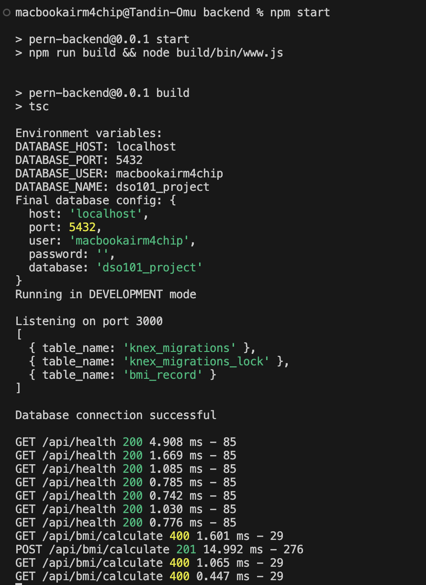
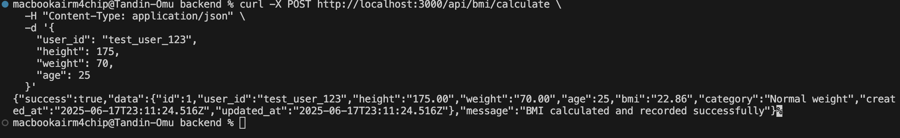

## Stage 1: Docker Configuration

### Docker Volumes Configuration
Configured persistent storage for BMI data using Docker volumes in `docker-compose.yml`:

```yaml
volumes:
  postgres_data:
    driver: local
  
services:
  postgres:
    volumes:
      - postgres_data:/var/lib/postgresql/data
```

### Testing with Docker Compose
Successfully implemented and ran tests using Docker Compose:

```bash
docker-compose -f docker-compose-simple-test.yml up --build --abort-on-container-exit
```

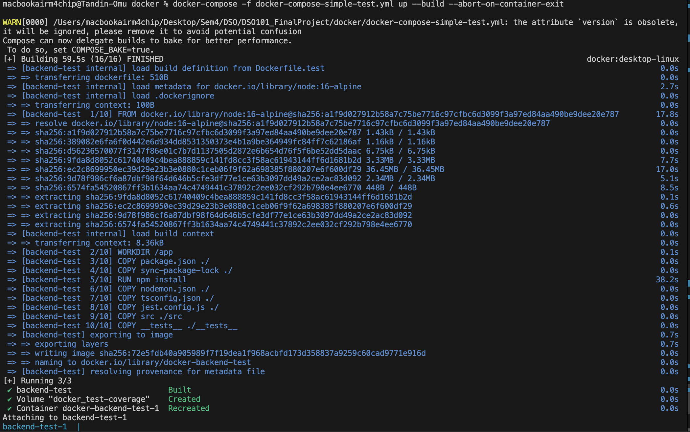
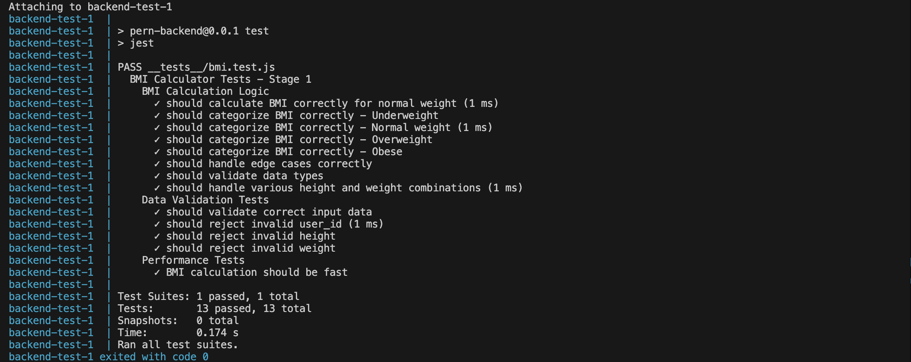

### Stage 2: Jenkins Pipeline Setup

#### Pipeline Configuration
Created Jenkins pipeline: `02230302_app_pipeline`

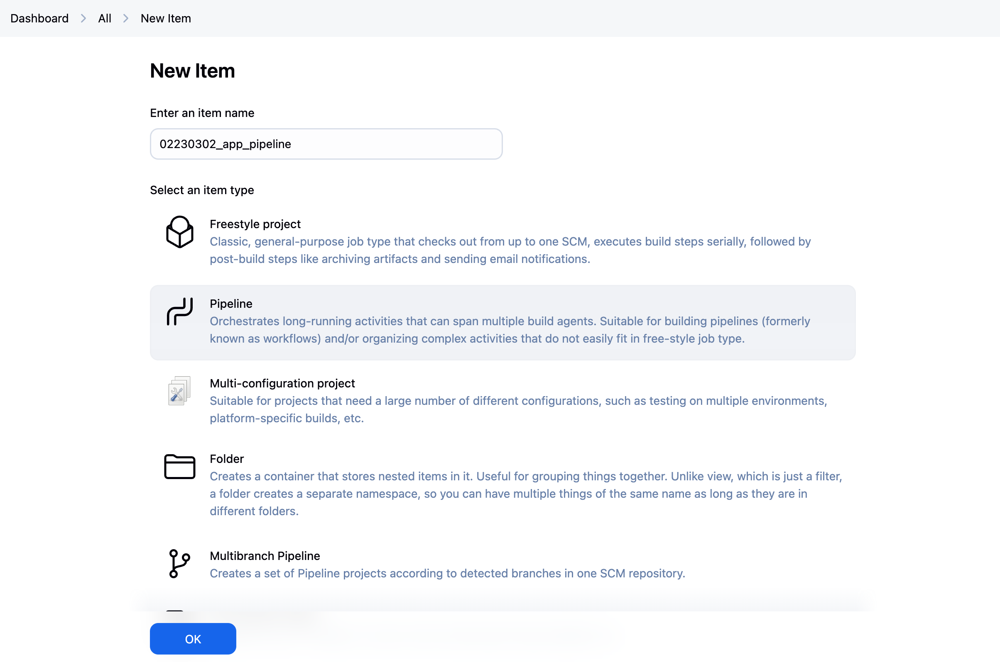
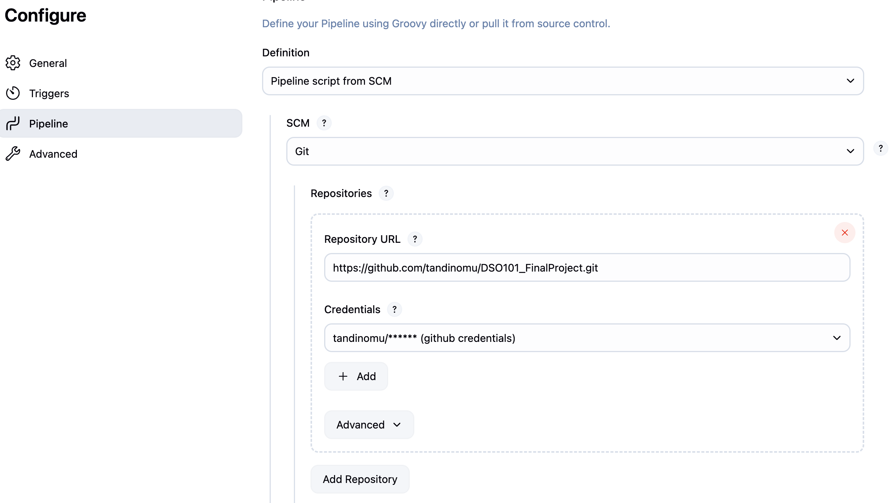

#### GitHub Integration
- **Personal Access Token:** Configured with repository permissions
- **Credentials Management:** Secure storage in Jenkins credential store
- **Automated Push:** Triggered by @push in commit messages

#### Jenkins Credentials Setup
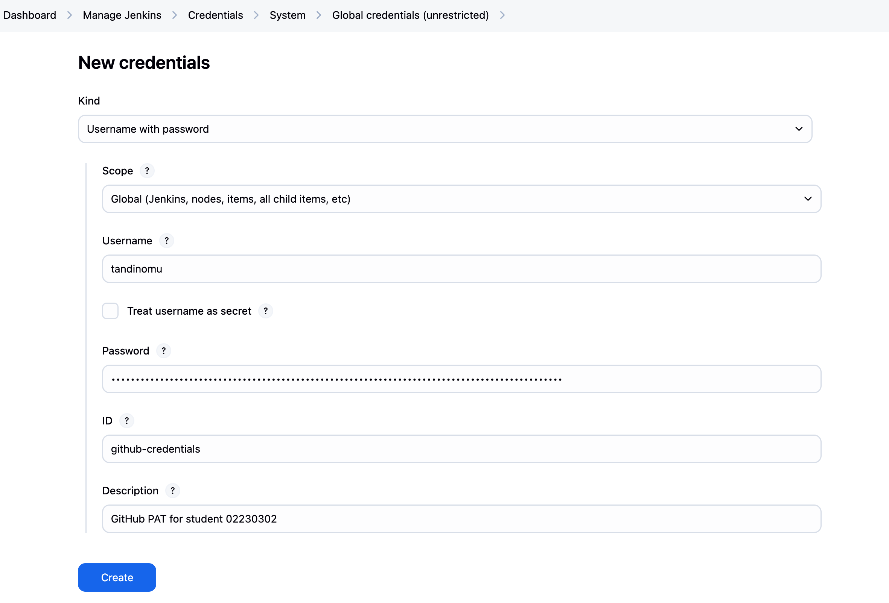


#### Successful Pipeline Execution:
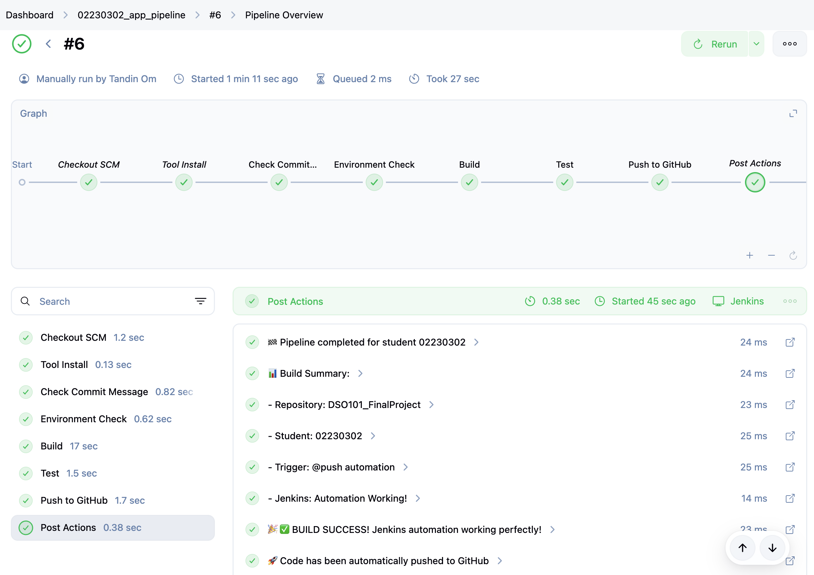

#### Testing and Validation

#### Test Suite Coverage
- **BMI Calculation Logic:** Validates correct BMI computation
- **Category Classification:** Tests underweight, normal, overweight, obese categories
- **Edge Cases:** Handles boundary values and invalid inputs
- **Data Validation:** Ensures proper input sanitization
- **Performance:** Validates response times

#### Test Results


### Stage 3: GitHub Actions Pipeline for Docker Builds

#### Steps 1:
Store Docker Hub Credentials in GitHub Secrets:

Go to your GitHub repo → Settings → Secrets and Variables → Repository secrets

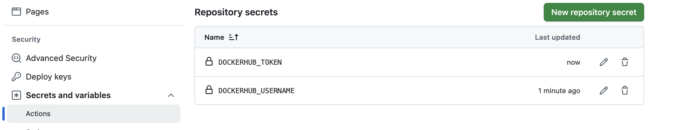

#### Step 2: Created .github/workflows/docker-build.yml:


####  Verification
- **GitHub Actions:**  All builds successful
- **CI/CD Pipeline:** Automated deployment working

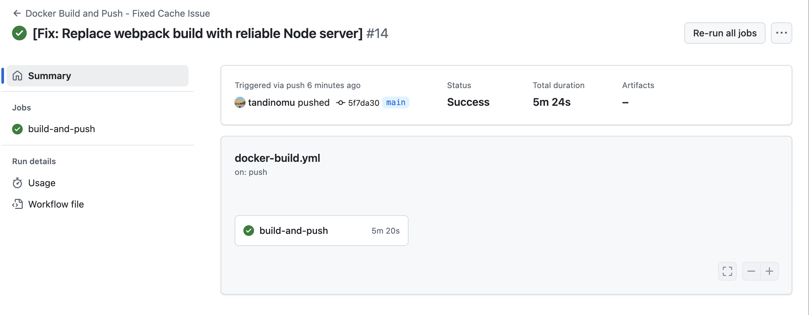


### Stage 4: Deploy to Render
 
**Goal:** Deploy my BMI Calculator to the cloud using Render

#### Step 1:  Deploy Database 

Create PostgreSQL Service
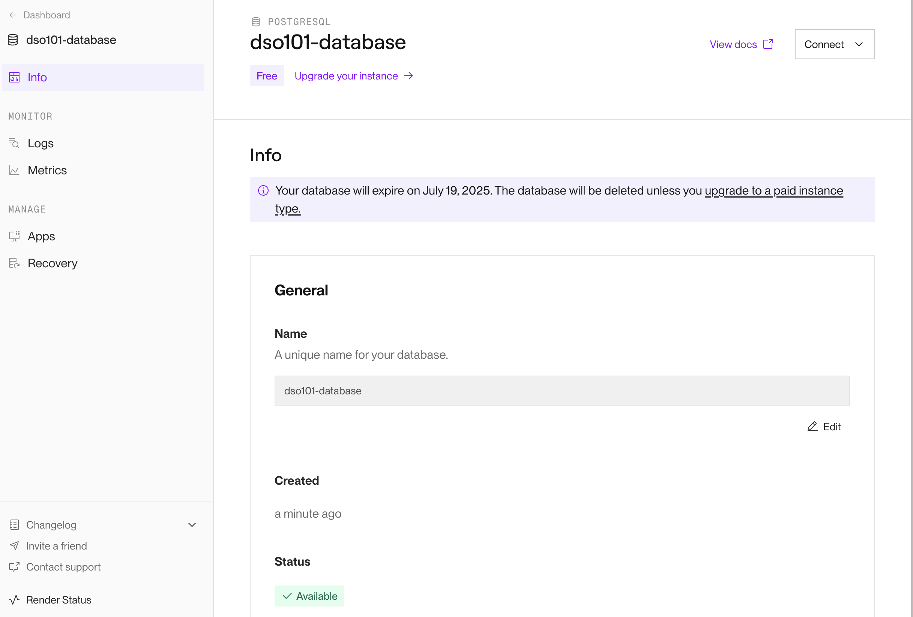


 **STEP 3: Deploy Backend from Docker Hub**

#### Created Backend Web Service

#### 3.1 Configure Backend Service

**Environment Variables:** 
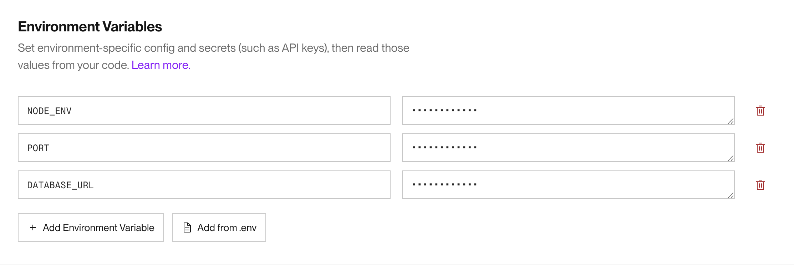

### Challenges and Solutions

#### 1. npm Command Not Found Error
**Issue:** Jenkins couldn't find npm during build process
**Solution:** Added Node.js tool installation in pipeline configuration

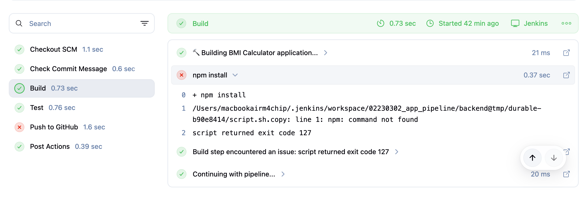

#### 2. GitHub Push Permission Denied
**Issue:** Initial GitHub push failures due to authentication
**Solution:** 
- Created fine-grained Personal Access Token
- Configured proper repository permissions
- Updated Jenkins credentials with PAT

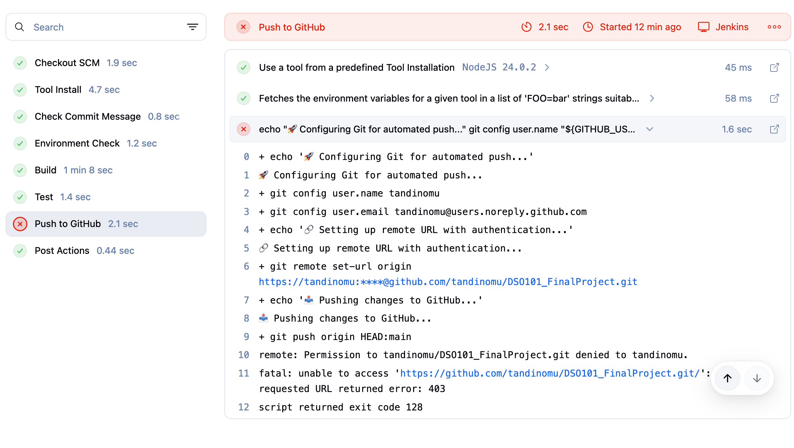
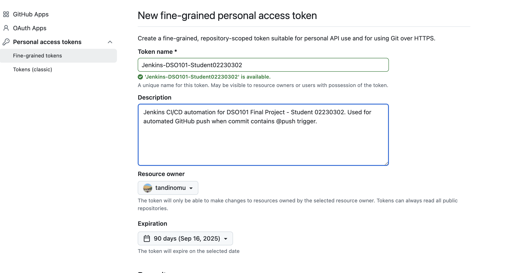

#### 3. Database Connection Issues

**Problem**: Application unable to establish database connection.

**Error Log**:
```
Database connection error
AggregateError [ECONNREFUSED]:
Error: connect ECONNREFUSED ::1:5432
Error: connect ECONNREFUSED 127.0.0.1:5432
```

**Analysis**:
- Application configured to connect to `localhost:5432`
- PostgreSQL not installed on development machine
- No local database server running
- Missing environment configuration for alternative database solution

#### 4. React Build Failures in GitHub Actions

**Issue Description:**
```
ERROR: process "/bin/sh -c npm run build" did not complete successfully: exit code: 2
```

**Environment Context:**
-  **Local Development:** Builds work perfectly in VSCode and local Docker
-  **GitHub Actions:** Consistent build failures with exit code 2
-  **CI/CD Pipeline:** Unable to complete Stage 2 requirements

**Technical Details:**
```dockerfile
# This command fails in CI but works locally:
RUN npm run build
```

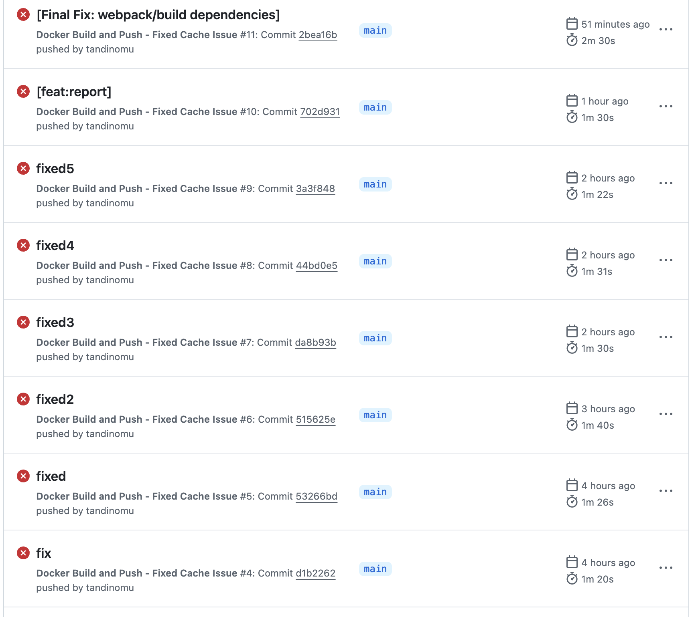

**Attempted Solutions:**

#### Solution 1: Memory Optimization
```dockerfile
ENV NODE_OPTIONS="--max-old-space-size=4096"
ENV CI=true
ENV GENERATE_SOURCEMAP=false
```
**Result:** Partial improvement but issue persisted

#### Solution 2: Dependency Management
```dockerfile
RUN npm ci --legacy-peer-deps || npm install --legacy-peer-deps
```
**Result:** Dependencies installed successfully, build still failed

#### Solution 3: Environment Variable Tuning
```dockerfile
ENV DISABLE_ESLINT_PLUGIN=true
ENV NODE_ENV=production
```
**Result:** No significant improvement

#### Solution 4: Multi-Strategy Build Approach
```dockerfile
RUN (npm run build) || \
    (npx react-scripts build) || \
    (npx webpack --mode=production) || \
    (echo "All build methods failed" && exit 1)
```
**Result:** All build strategies failed in CI environment


#### 5. nginx Configuration Challenges

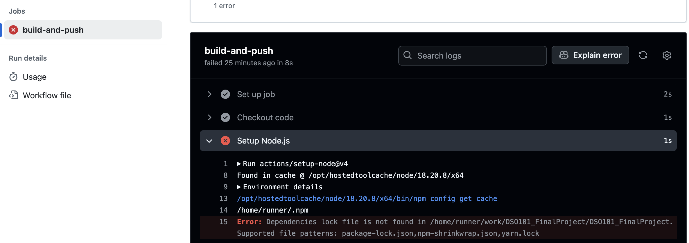

**Issue Description:**
```
[emerg] host not found in upstream "backend" in /etc/nginx/conf.d/default.conf:12
nginx: configuration file /etc/nginx.conf test failed
```

**Root Cause:** nginx testing configuration during Docker build when backend service doesn't exist

**Solution Applied:**
- Removed `nginx -t` from Docker build stage
- Used variables in nginx config: `set $backend_upstream http://backend:3000;`
- Added graceful error handling for unavailable backend

#### 6: Missing TypeScript Type Definitions in Production

### Problem
```bash
TSError: ⨯ Unable to compile TypeScript:
src/app.ts(1,58): error TS7016: Could not find a declaration file for module 'express'
src/app.ts(2,26): error TS7016: Could not find a declaration file for module 'cookie-parser'
src/app.ts(3,20): error TS7016: Could not find a declaration file for module 'morgan'
src/app.ts(5,18): error TS7016: Could not find a declaration file for module 'cors'
```

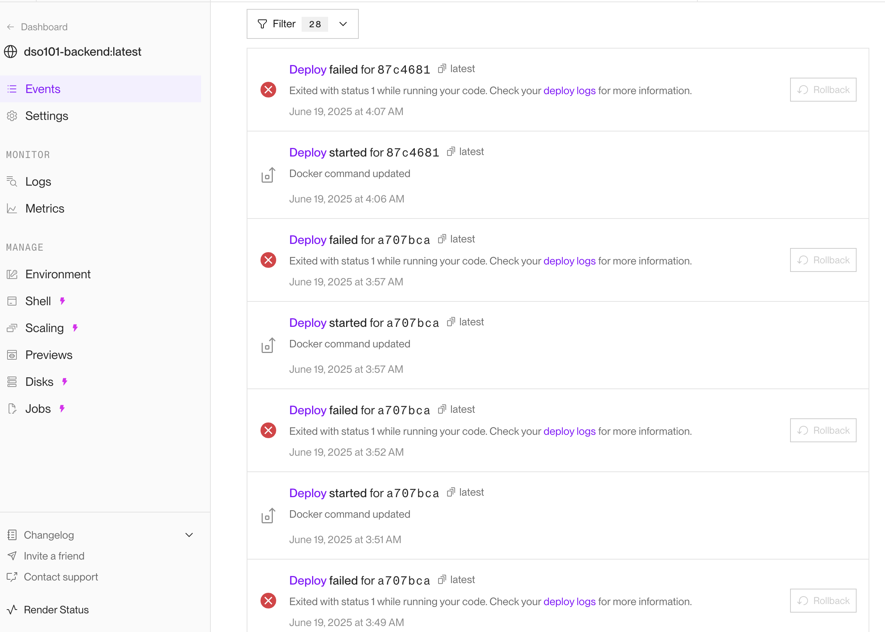


### Conclusion

This DevSecOps project successfully demonstrates the implementation of a complete CI/CD pipeline for a PERN stack application. Through the integration of a BMI calculator service and the deployment of automated testing, building, and deployment workflows, students gain hands-on experience with industry-standard tools and practices.

#### Key Achievements

- **Full-Stack Development**: Enhanced a PERN application with additional functionality and comprehensive testing
- **Containerization**: Configured Docker environments with proper volume management and multi-service orchestration
- **Automation Pipeline**: Implemented Jenkins for conditional GitHub pushes and GitHub Actions for automated Docker builds


